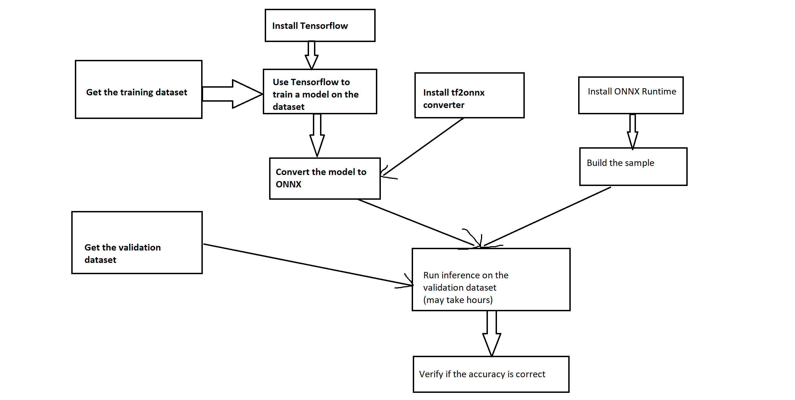

# Overview




WARNING: If you want to train the model by yourself, you need at least 500GB disk space and a powerful NVIDIA GPU.

# Install tensorflow
Install Python 3.x from [python.org](https://www.python.org/), then execute
```
pip install --upgrade tensorflow==1.14
```
For more information, see [Install Tensorflow](https://www.tensorflow.org/install)

# Get the Imagenet dataset
We need the [ILSVRC-2012-CLS](http://www.image-net.org/challenges/LSVRC/2012/) image classification dataset from http://www.image-net.org/.

If you're going to train the model by yourself, then you need the full dataset, which is about 500GB. Otherwise, you only need the 
validation data set, which is just about 3GB.

For how to get the data, see [ImageNet Download faq](http://image-net.org/download-faq). Once you get an account, visit http://www.image-net.org/download-images. You will find "Download links to ILSVRC2012 image data" on that page

And also, please download the "[imagenet_lsvrc_2015_synsets.txt](https://raw.githubusercontent.com/tensorflow/models/master/research/slim/datasets/imagenet_lsvrc_2015_synsets.txt)" and "[imagenet_2012_validation_synset_labels.txt](https://raw.githubusercontent.com/tensorflow/models/master/research/slim/datasets/imagenet_2012_validation_synset_labels.txt)" from tensorflow models repo.

# Get the model
Please check [https://github.com/tensorflow/models/tree/master/research/slim/](https://github.com/tensorflow/models/tree/master/research/slim/).
You may either train the model by yourself, or just download a pretrained model provided by Google. 
If you don't know which one to download and try, we suggest you choose the [Inception V4](http://download.tensorflow.org/models/inception_v4_2016_09_09.tar.gz) model as a starting point.

After downloading, please uncompress it.
```
tar -zxvf inception_v4_2016_09_09.tar.gz
```

The [Inception V4] zip file only contains a single checkpoint file: inception_v4.ckpt. It can't be directly used for inferencing. 
You need to combine the network definition and the checkpoint. Please follow the steps below:

1. Export the graph.
```
git clone https://github.com/tensorflow/models
# Copy inception_v4.ckpt into models
cd models
# Ignore deprecation warnings
python research\slim\export_inference_graph.py --model_name=inception_v4 --output_file=graph.pb
```

2. Freeze the graph
Run
```
freeze_graph.exe --input_graph=graph.pb --input_checkpoint=inception_v4.ckpt --output_graph=inception_v4.pb --output_node_names=InceptionV4/Logits/Predictions --input_binary=true
```

# Convert the model to ONNX

```
pip install --upgrade tf2onnx 
python -m tf2onnx.convert --input inception_v4.pb --inputs input:0 --outputs InceptionV4/Logits/Predictions:0 --opset 10 --output inception_v4.onnx
```

You should see messages like these:

INFO - Successfully converted TensorFlow model inception_v4.pb to ONNX

INFO - ONNX model is saved at inception_v4.onnx

# Run the inferencing 
In your build dir of onnxruntime_samples, search for "image_classifier.exe" and run 
```
image_classifier.exe C:\tools\imagnet_validation_data inception_v4.onnx imagenet_lsvrc_2015_synsets.txt imagenet_2012_validation_synset_labels.txt 32
```
Please replace the file names with the corresponding file paths.

The last parameter is batch size, you may need to adjust it according to your GPU memory size.
